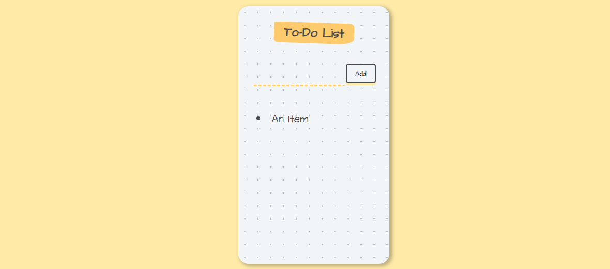

<h1 align="center">To Do List</h1>
  
Project for learning React

 
 

## What is this project about?
This is a To Do List, where you write a new item, click 'Add' button and it gets added to a list of bullet points. You can remove the item from the list by clicking on it.

## Technologies used
- HTML
- CSS
- JavaScript
- GIT
- React
 

## What have I learned?
- JavaScript spread operator,
- managing a component tree
 
 

*project is based on [Web Development Course](https://www.udemy.com/course/the-complete-web-development-bootcamp/)
